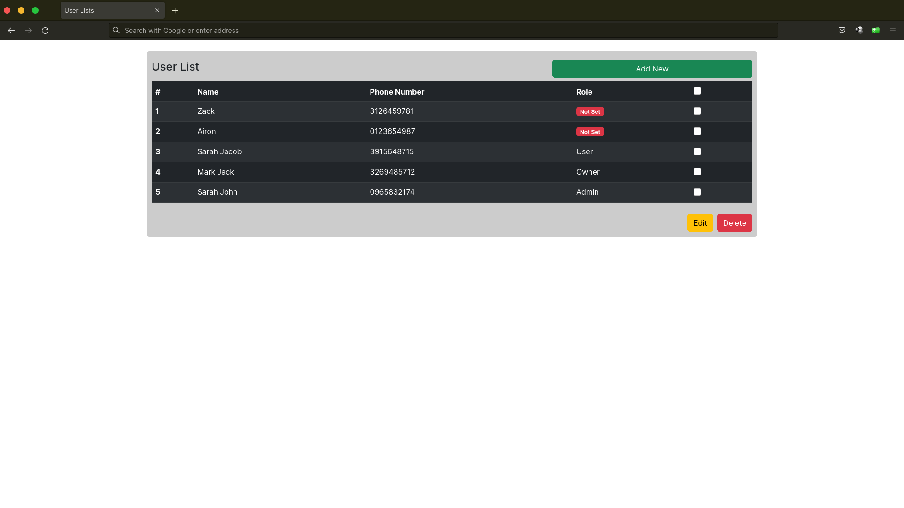
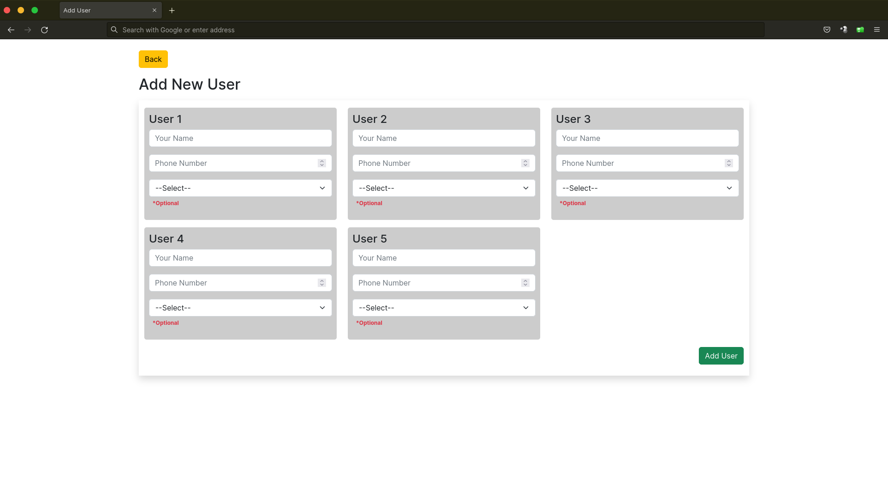

# SIMPLE CRUD MULTIPLE DATA - VANILA PHP
Project ini dibina atas dasar percubaan dan pembelajaran sahaja,
jika anda ingin gunakan secara live, anda perlu tingkatkan securiti pada project ini terlebih dahulu,
pihak kami tidak akan bertanggung jawab atas apa yang berlaku pada website anda

- Add Multiple Data
- Delete Multiple Data
- Auto Create Database
- Auto Create Table

## Langkah Menjalankan project
jika anda ingin clone menggunakan http
```
# jika gitlab
git clone https://gitlab.com/azrilsyamin/add-multi-data.git
# jika github
git clone https://gitlab.com/azrilsyamin/add-multi-data.git
```
atau sekiranya anda ingin clone menggunakan SSH
```
# jika gitlab
git clone git@gitlab.com/azrilsyamin/add-multi-data.git
# jika github
git clone git@gitlab.com/azrilsyamin/add-multi-data.git
```
kemudian anda perlu copy file `conf.txt` kepada `conf.php`
```
cd add-multi-data/
cp conf.txt conf.php
```
jangan lupa masukkan detail anda
```
$host = ""; //localhost
$user = ""; //user
$pass = ""; //pass
$dbName = ""; //database name
```
kemudian boleh buka url web anda, database dan table akan dibuat secara auto

## Preview
list all user

Add user



